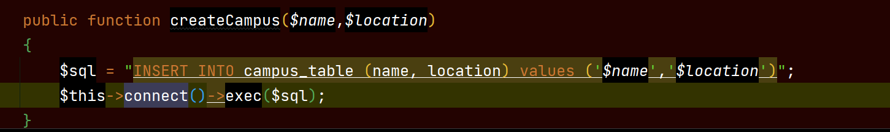
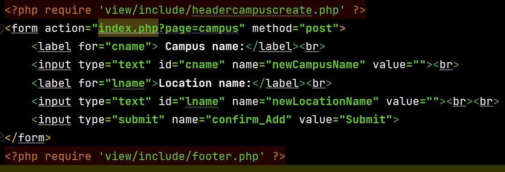
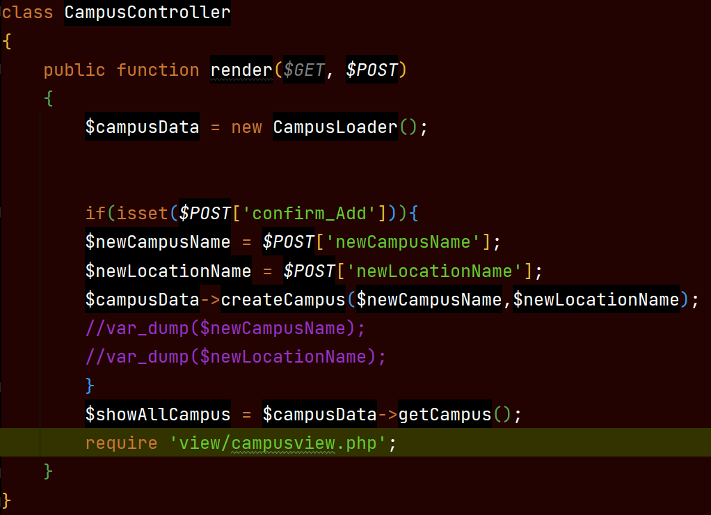

# PHP CRUD

***

- **Team challenge:** `Michael` `Pablo` `Alex` `Zeno`
- **CRUD:** `Create Read Update Delete`

***

A new day, a new challenge, a team challenge. The group had to choose if this challenge would be a team challenge or a solo one.
It was a tie, but in the end we **flipped a coin** and the team won.
Our group is glad about it, because in the end this will prepare us better for the future when we start our development career.
Let's get started!

***

## The Mission
The mission is to create a CRUD system to store student, teacher, group and campus information in the database.
We will use the MVC structure that is provided. We will end up with at least 4 models and 4 controllers, but this could be more.

***

We'll divide the work as follows:
- `Michael` will make everything for students
- `Pablo` will make everything for campus
- `Alex` will make everything for teacher
- `Zeno` will make everything for group

As a group we will set up everything for _**git**_ and make the _**database**_.

## TO DO

### As a group
***
- [x] Set up our git
    - [x] Create a production branch
    - [x] Each of us creates their own branch to work
- [x] Make our database
    - [x] Tables
        - [x] group_table
          - id
          - name
          - teacher_id
          - campus_id
        - [x] student_table
          - id
          - name
          - email
          - group_id
        - [x] teacher_table
          - id
          - name
          - email
        - [x] campus_table
          - id
          - name
          - location
- [x] export with mysqldump
- [x] env file
- [x] Our database connection, Datasource class

### Individually
- [x] MVC Model
  - [x] Create Model Class
  - [x] Create Controller
  - [x] Create View
- [x] Overview of all records of your entity in a table
  - [ ] Each row has a button to edit or delete entity
  - [x] Page should have a `create new` button
- [ ] Detailed overview of the selected entity
  - [ ] include a button to delete this entity
    - Edge case: A teacher cannot be removed if he is still assigned to a class
    - Edge case: If you remove a class, make sure to remove the link between the students and the class.
- [ ] Page to edit and existing entity
- [x] Page to create a new entity

***

## Stand-up meeting 14/07/2022
***

Yesterday we managed to create our database, so our goal for today is to var_dump the data for each page and to get the controllers working to go from one page to another.

HomePage buttons where to go -> Student / Teacher / Group / Campus

GENERAL OVERVIEW

- General Overview of all records of that entity a table (each row has a button to edit or delete).
- Page should have a "create new" button.


DETAILED OVERVIEW

- include a button to delete this entity
- teacher cannot be removed if he is still assigned to a class (if you remove the link between the students and the class)


PAGE TO EDIT existing entity
PAGE TO CREATE a new entity


***

## Friday 15/07/2022
***

Friday was a day full of ups and downs for the group. The half of the group was at campus and the other half at home. Communication was rusty. 
Which complicated everything, we all went on our individual coding spree. We all managed to read the data but the next steps to create, update and delete where not discussed properly and we couldn't manage to make these work on friday.
Some of our group managed to work further during the weekend, Michael made extra branches for testing. Zeno couldn't be there because of his renovations.

***

## Monday 18/07/2022
***

So new day, fresh minds, totally refueled, but still a monday.
The most important thing at the moment is reflecting on what we did, how we did and what we can improve for the future.

So when we all had our read pages for our data, we found out it would have been easier to start a merge from that point.
When then making the create, update and delete button we could have used the classes and methods from the other pages, where needed.
For instance to make a new group it would have been handy to make a dropdown list for teachers and campuses. To choose which teacher would belong to a new group and at what campus the group would be located.

Now let's take a look at our buttons:

### Create

Let's say we want to create a new campus, what do we need?

#### STEP 1
- We need a new function in our Model that will tell our database to create a new Campus.



- Our sql statement will insert a new name and location into our campus_table. We use 2 placeholders which will contain the input values.
- $this->connect()->exec($sql), we first make a connection to the database and exec will execute our sql statement.

#### STEP 2
- We'll need a new page in our View that will have an input field for a new name and a location where the campus will be located.



- Our action will bring us back to the campus page once we press the submit button. We make use of the post method. For the input fields it's important to give these a name, in our case we have 'newCampusName' and 'newLocationName' these we will need for our controller. Our button we also name, 'confirm_Add' which in turn we will also need for the controller.

#### STEP 3
- In our controller we can retrieve the input data from our create page.



- In our render function we make a new CampusLoader (this extends our datasource) where we can access our methods.
- If we press the submit button it will store 2 variables 'newCampusName' and 'newLocationName' inside $POST.
- In the function createCampus we place our 2 variables that contain the input data that needs to be added in the database.
- When we return to our campus overview, we will see that we added a new Campus.


### Update

To update an existing row of a table what we'll do:

#### STEP 1
- We create a new function in our model class, we can name it editCampus
- ```php
    public function editCampus(int $id, string $name, string $location)
    {
        $sql = "UPDATE campus_table SET name=?, location=? WHERE id=?";
        $stmt = $this->connect()->prepare($sql);
        $stmt->execute([$newName, $newLocation, $id]);
    }
  ```

- Next we make a new view page, we can call it editCampus.php:
- ```html
    <form action="index.php?page=campus" method="post">
        We don't have enough time, so we don't know what to do here yet.
    </form>
  ```

- Then we can go to the controller:
- ```php
    if(isset($POST['update'])){
        Not enough time, we will reflect on this.
    }
    $showAllCampus = $campusData->getCampus();
  ```

### Delete

To delete a row we don't need a new view page. 

In our campusLoader we could add a function deleteCampus($id)
Our sql statement will be different and we will delete by id.
- ```php
    $sql = "DELETE FROM student_table WHERE id =" . $id;
    $this->connect()->exec($sql);
  ```

In our campus controller:
- ```php
    if(isset($POST['remove'])){
    $deleteId = $POST['remove'];
    $campusData->deleteCampus($deleteId);
    }
    $showAllCampus = $campusData->getCampus();
  ```
  
## What we learned
- Planning is key!
- First setup a good working environment on github
- Don't start coding too fast, first create a scheme on how we need to work on the whole project.
- Reflect more.
- Already start to merge things once we finished something. If we then have issues we can fix them early on.
- We learned about foreign keys in databases and how to link them, this went surprisingly well for us.
- Do more stand-up meetings, we did when we were together, but forgot to do them when we were not together

## Problems we encountered
- We had some communication issues, because Pablo, Zeno and Michael would change to Dutch too often, it was not fun for Alex. We talked about this and it is something we can improve on, and we'll deal with this early on.
- We started of well, but because we didn't even look further ahead, we eventually encountered a wall.
- We found that the timeframe we had was very short for such an exercise.
- We are still all new to MVC and learning at the pace we needed to code was very hard.
- We had issues with merging, also because we have not done too many group projects it isn't always easy at the pace we are going with the course.
- We communicated well the day we were all together, once we started working from home we lost our communication.
- Make sure everyone is following so everyone understands what's happening